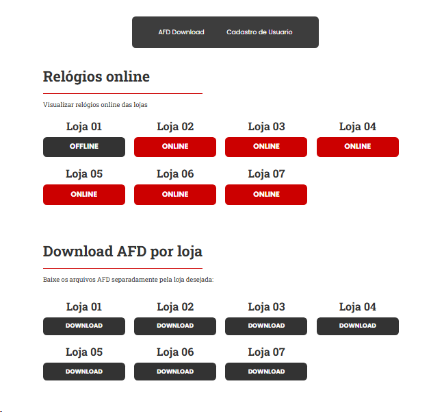
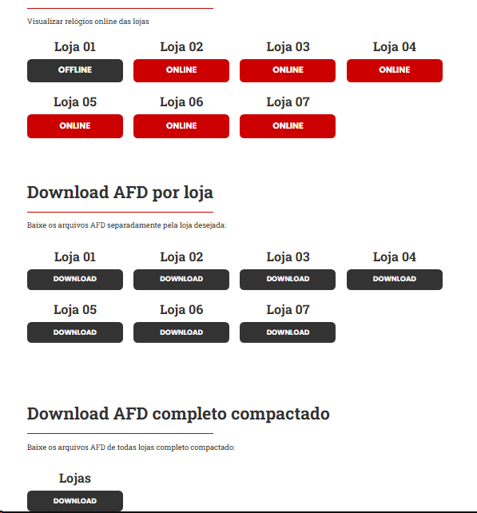
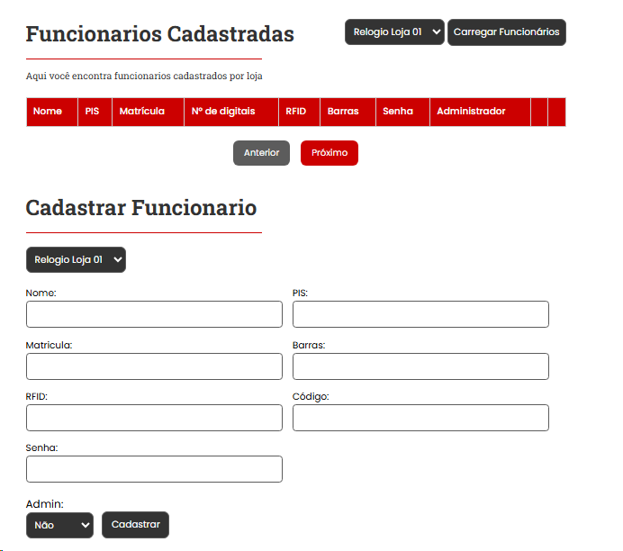

# Projeto de Integração com Relógios de Ponto CONTROL ID V1





## ✅ Requisitos

- [Node.js](https://nodejs.org/) instalado
- Os relógios de ponto **devem estar na mesma rede interna** do servidor para permitir a comunicação e o download dos arquivos AFD

---

## 📦 Instalação

1. Clone o repositório e acesse a pasta do projeto
2. Instale as dependências:

```bash
npm install
Para iniciar o projeto em modo de produção:

bash
Copiar
Editar
npm run production
📌 Por padrão, o servidor roda na porta 3030, mas isso pode ser alterado no arquivo:

pgsql
Copiar
Editar
/server/index.js
Após iniciar o servidor, acesse no navegador:

bash
Copiar
Editar
http://localhost:3030/dashboard

## 📥 Configuração de Relógios para Download de AFD 

Para realizar o download dos arquivos AFD dos relógios de ponto, é necessário configurar os dados de conexão no arquivo:

/server/routes/lojaDownloadCad.js

css
Copiar
Editar

Exemplo de configuração:

```js
DownloadAfd01: {
    ip: '192.168.0.1',
    login: 'admin',
    senha: '1234',
},
⚠️ Importante: O relógio de ponto deve estar na mesma rede interna do servidor para que o download dos arquivos funcione corretamente.

📡 Verificador de Relógios Online (Ping)
Para habilitar o verificador de relógios online via ping, edite o arquivo:

bash
Copiar
Editar
/server/routes/pingService.js
Adicione os IPs dos relógios que deseja monitorar, conforme necessário.

🖥️ Frontend
Os arquivos HTML do frontend estão localizados na pasta:

bash
Copiar
Editar
/src

